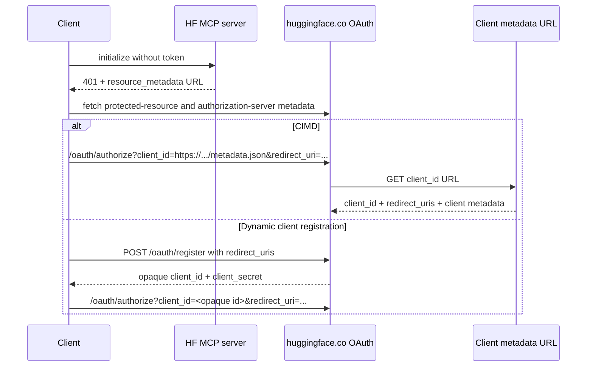

# OAuth and CIMD diagnostics

The HF MCP server does not register OAuth clients or host their Client ID Metadata Documents (CIMD). On a forced
authentication request it returns:

```http
HTTP/1.1 401 Unauthorized
WWW-Authenticate: Bearer resource_metadata="https://huggingface.co/.well-known/oauth-protected-resource/mcp?login"
```

The client follows that document to Hugging Face's authorization-server metadata. Hugging Face currently advertises
both a dynamic registration endpoint and `"client_id_metadata_document_supported": true`.



## Run a local OAuth client

The default command connects directly to `https://huggingface.co/mcp?login`, dynamically registers an in-memory client
configuration, listens on a loopback callback, prints the authorization URL, and keeps all credentials in memory:

```bash
pnpm oauth:diagnose
```

The diagnostic deliberately narrows HF's advertised scope set to `read-mcp`; it does not request identity, job,
repository-write, or inference scopes. Override this only when testing scope behavior:

```bash
pnpm oauth:diagnose -- --scope 'openid profile read-mcp'
```

Dynamic registrations and user grants are created remotely and may remain at Hugging Face after the process exits.
Prefer CIMD mode for repeated client-metadata testing because it does not create an opaque client registration.

To run the MCP server from this repository as well:

```bash
# Terminal 1
pnpm dev:json

# Terminal 2
pnpm oauth:diagnose -- --server 'http://127.0.0.1:3000/mcp?login'
```

The local server still points OAuth discovery at Hugging Face. That is intentional: OAuth authorization and token
issuance happen at `huggingface.co`; the MCP server only emits the resource challenge and validates the resulting HF
access token.

## Run a true local CIMD test

HF cannot fetch a metadata document from localhost. Production authorization servers must avoid fetching loopback and
private addresses because that would create an SSRF primitive. The diagnostic therefore creates a separate,
metadata-only local listener and uses a temporary Cloudflare tunnel to make it publicly reachable over HTTPS:

```bash
pnpm oauth:diagnose -- --cimd
```

This requires `cloudflared` on `PATH`. The command:

1. Starts the OAuth callback at `http://127.0.0.1:8090/oauth/callback`.
2. Starts a second metadata-only listener on a random loopback port.
3. Exposes only the metadata listener through a temporary `https://*.trycloudflare.com` URL.
4. Uses that exact public URL as `client_id`.
5. Includes `http://127.0.0.1:8090/oauth/callback` in the document's `redirect_uris`.
6. Prints and validates both the authorization request and fetched CIMD document.
7. Stops the tunnel after the test.

To test an already-hosted document instead:

```bash
pnpm oauth:diagnose -- \
	--client-metadata-url 'https://client.example/oauth/metadata.json' \
	--redirect-uri 'http://127.0.0.1:8090/oauth/callback'
```

## Inspect the failing client's request

Copy the complete URL sent to the browser and run:

```bash
pnpm oauth:diagnose -- --inspect-auth-url \
	'https://huggingface.co/oauth/authorize?client_id=...&redirect_uri=...'
```

Quote the URL so the shell does not interpret its `&` characters. If `client_id` is an HTTPS URL with a non-root path,
the command resolves and fetches it with a 5 KiB streaming limit. It rejects non-HTTPS, loopback, private, link-local,
and other special-use destinations, including redirect targets. It then checks:

- the response is `200` with a JSON media type and no redirect changed the fetched URL;
- the body is no larger than the recommended 5 KiB;
- the document's `client_id` exactly equals the URL used as `client_id`;
- the authorization request's `redirect_uri` exactly matches an entry in `redirect_uris`;
- the document contains no client secret or shared-secret token authentication method.

If `client_id` is opaque, there is no CIMD document to find. The client used dynamic registration or a manually
pre-registered OAuth application, and the registered metadata lives at Hugging Face.

## Common causes of `Invalid redirect_uri`

OAuth redirect matching is exact. Check differences that are easy to overlook:

- `localhost` versus `127.0.0.1`;
- `http` versus `https`;
- a changed callback port;
- `/callback` versus `/callback/`;
- URL encoding or case differences;
- a redirect URI generated at runtime that is absent from the CIMD document;
- a document whose `client_id` field differs from its public URL;
- stale client registration data when an opaque `client_id` is being reused.

The relevant server implementation is
[`packages/app/src/server/utils/oauth-resource.ts`](../packages/app/src/server/utils/oauth-resource.ts). The resource
and authorization-server documents can be inspected directly:

```bash
curl -sS https://huggingface.co/.well-known/oauth-protected-resource/mcp | jq
curl -sS https://huggingface.co/.well-known/oauth-authorization-server | jq
```
